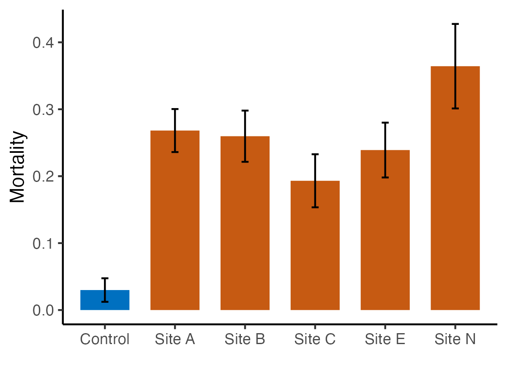

```{r message=FALSE, warning=FALSE, eval=FALSE}
library(ggplot2)
library(reshape2)
library(colorspace)
library(cowplot)
library(RColorBrewer)
library(nlme)

#Create summary of the data
summarySE <- function(data=NULL, measurevar, groupvars=NULL, na.rm=FALSE,
                      conf.interval=.95, .drop=TRUE) {
    library(plyr)
    # New version of length which can handle NA's: if na.rm==T, don't count them
    length2 <- function (x, na.rm=FALSE) {
        if (na.rm) sum(!is.na(x))
        else       length(x)
    }

    # This does the summary. For each group's data frame, return a vector with
    # N, mean, and sd
    datac <- ddply(data, groupvars, .drop=.drop,
      .fun = function(xx, col) {
        c(N    = length2(xx[[col]], na.rm=na.rm),
          mean = mean   (xx[[col]], na.rm=na.rm),
          sd   = sd     (xx[[col]], na.rm=na.rm)
        )
      },
      measurevar
    )

    # Rename the "mean" column    
    datac <- rename(datac, c("mean" = measurevar))

    datac$se <- datac$sd / sqrt(datac$N)  # Calculate standard error of the mean

    # Confidence interval multiplier for standard error
    # Calculate t-statistic for confidence interval: 
    # e.g., if conf.interval is .95, use .975 (above/below), and use df=N-1
    ciMult <- qt(conf.interval/2 + .5, datac$N-1)
    datac$ci <- datac$se * ciMult

    return(datac)
}

```


# Urchin assay data analysis  

```{r message=FALSE, warning=FALSE, eval=FALSE}

urchin<-read.csv("../Data/urchin_embryo_assay.csv")

shapiro.test(urchin$Mortality)
#data:  urchin$Mortality
#W = 0.96923, p-value = 0.6481

bartlett.test(Mortality ~ Site, data=urchin)
#data:  Mortality by Site
#Bartlett's K-squared = 3.9749, df = 5, p-value = 0.553

aov1<-aov(Mortality ~ Site, data=urchin)
summary(aov1)
#            Df Sum Sq Mean Sq F value   Pr(>F)    
#Site         5 0.2471 0.04941   7.381 0.000639 ***
#Residuals   18 0.1205 0.00669


TukeyHSD(x=aov1,'Site', conf.level=0.95)
#                 diff         lwr       upr     p adj
#Site 1-REF     0.23830  0.05443832 0.4221617 0.0071770**
#Site 2-REF     0.22985  0.04598832 0.4137117 0.0097677**
#Site 3-REF     0.16325 -0.02061168 0.3471117 0.0990839.
#Site 4-REF     0.20915  0.02528832 0.3930117 0.0206223*
#Site 5-REF     0.33445  0.15058832 0.5183117 0.0002207***
#Site 2-Site 1 -0.00845 -0.19231168 0.1754117 0.9999889
#Site 3-Site 1 -0.07505 -0.25891168 0.1088117 0.7827645
#Site 4-Site 1 -0.02915 -0.21301168 0.1547117 0.9953719
#Site 5-Site 1  0.09615 -0.08771168 0.2800117 0.5715379
#Site 3-Site 2 -0.06660 -0.25046168 0.1172617 0.8534368
#Site 4-Site 2 -0.02070 -0.20456168 0.1631617 0.9990886
#Site 5-Site 2  0.10460 -0.07926168 0.2884617 0.4852101
#Site 4-Site 3  0.04590 -0.13796168 0.2297617 0.9650794
#Site 5-Site 3  0.17120 -0.01266168 0.3550617 0.0765031.
#Site 5-Site 4  0.12530 -0.05856168 0.3091617 0.2999601


sum<-summarySE(urchin, measurevar="Mortality", groupvars=c("Site"))

#urchin$type<-ifelse(urchin$Site=="Ref", "A","B")
urchin$Site<-factor(urchin$Site, levels=c("Control","Site A","Site B","Site C","Site E","Site N"))
sum$Site<-factor(sum$Site, levels=c("Control","Site A","Site B","Site C","Site E","Site N"))
ggplot(urchin, aes(x=Site, y=Mortality, fill=Site))+
    geom_bar(stat="summary", fun="mean", width=0.7)+
    xlab('')+
    scale_fill_manual(values=c("#0070C0", "#C65A12","#C65A12","#C65A12","#C65A12","#C65A12"), guide="none")+
#    scale_fill_manual(values=c("#0070C0","#843C0B","#843C0B","#843C0B","#843C0B","#843C0B"),guide="none")+
    geom_errorbar(data=sum, aes(ymin=Mortality-se, ymax=Mortality+se), width=.1) +
    theme_classic()
#ggsave("../Output/urchin_assay_results_colored.png", width = 4, height=3, dpi=300)
ggsave("../Output/urchin_assay_results_colored.pdf", width = 4, height=2.7)


```



# Urchin results all bay sites vs. control 

```{r message=FALSE, warning=FALSE, eval=FALSE}
urchin<-read.csv("../Data/urchin_embryo_assay.csv")
urchin$type<-ifelse(urchin$Site=="Control", "A","B")

sum2<-summarySE(urchin, measurevar="Mortality", groupvars=c("type"))
#  type  N Mortality         sd         se         ci
#1    A  4  0.029875 0.03517986 0.01758993 0.05597901
#2    B 20  0.264875 0.09726733 0.02174964 0.04552251

#not appropriate
t.test(urchin$Mortality[urchin$type=="A"],urchin$Mortality[urchin$type=="B"] )

#wilcoxon test (two-wided = defalult)
wilcox.test(urchin$Mortality[urchin$type=="A"],urchin$Mortality[urchin$type=="B"])
# p-value = 0.002211

```


# Coral cell assays  

```{r message=FALSE, warning=FALSE, eval=FALSE}
# Coral assay
corals<-read.csv("../Data/coral_assay.csv")

summ<-summarySE(corals, measurevar="Mortality", groupvars=c("Treatment"))
summ

ggplot(summ, aes(x=Treatment, y=Mortality))+
    geom_bar(stat='identity', width=0.8)+
    geom_errorbar(data=summ, aes(ymin=Mortality-se, ymax=Mortality+se), width=.1) +
    theme_classic()

summary<-aggregate(corals$Mortality, by=list(corals$Site, corals$Treatment), mean)
colnames(summary)<-c("Site","Treatment","Mortality")
ggplot(summary, aes(x=Site, y=Mortality, fill=Treatment))+
    geom_bar(stat='identity', width=0.8, position=position_dodge())+
    theme_classic()+xlab("")+
    scale_fill_manual(values=c("#00AFB2","#7BBCAB","#B3E7C5","#DD6157")) 
ggsave("../Output/coral_cell_assay_results.png", width = 7, height = 4, dpi=300)

ggsave("../Output/coral_cell_assay_results.pdf", width = 7, height = 4)
```


# Mean number of embryos used  

```{r message=FALSE, warning=FALSE, eval=FALSE}
# Urchin assay
urchin<-read.csv("../Data/urchin_assay.csv")

mean(urchin$Total.Cells, na.rm=T)
#36.25
sd(urchin$Total.Cells, na.rm=T)
#9.2
std.error(urchin$Total.Cells, na.rm=T)
#1.8788 
```

Add a new chunk by clicking the *Insert Chunk* button on the toolbar or by pressing *Cmd+Option+I*.

When you save the notebook, an HTML file containing the code and output will be saved alongside it (click the *Preview* button or press *Cmd+Shift+K* to preview the HTML file). 

The preview shows you a rendered HTML copy of the contents of the editor. Consequently, unlike *Knit*, *Preview* does not run any R code chunks. Instead, the output of the chunk when it was last run in the editor is displayed.

